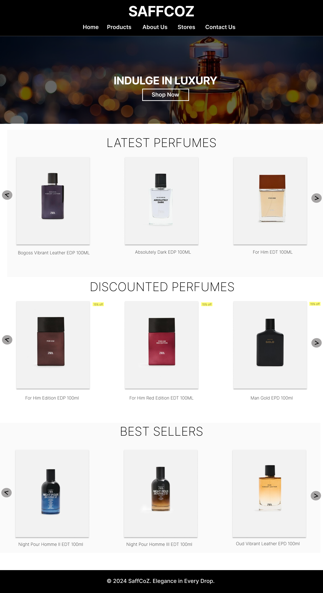

# SAFFCOZ
A sleek and elegant website for SaffCoZ, showcasing a premium range of perfumes. This project provides users with an immersive experience to explore, learn about, and purchase perfumes with ease.

# SaffCoZ Perfume Website
A sleek and elegant website for SaffCoZ, showcasing a premium range of perfumes. This project provides users with an immersive experience to explore, learn about, and purchase perfumes with ease.

# Features
Homepage: A welcoming display of featured perfumes and promotional banners.
Products Page: A detailed catalog of perfumes categorized for easy navigation.
Individual Product Page: Detailed descriptions, images, and prices for each perfume with purchase options.
About Us Page: Insights into the brand’s history, vision, mission, and signature products.
Stores Page: Information about offline store locations with images and addresses.
Contact Us Page: A form for user feedback, inquiries, and subscription to updates.
Responsive Design: Optimized for both desktop and mobile users.
Custom Styling: Uses Google Fonts and CSS for a modern, minimalist look.

# Technologies Used
HTML5: Structure of the website.
CSS3: Styling and layout.
JavaScript: Form validation and interactivity.

# Screenshots

